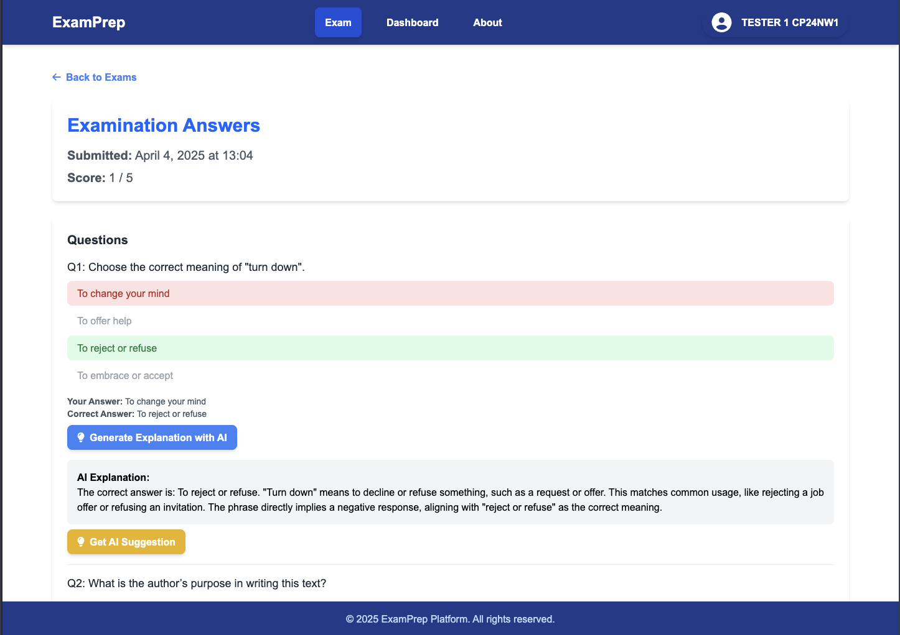

# Capstone Project – English Exam Practice Platform (User Frontend)

A web application for practicing English exams, providing interactive tests, instant scoring, and AI-powered explanations for users. 

E.g. This repository contains the **User Frontend** developed with React and Next.js as part of the Capstone Project at King Mongkut's University of Technology Thonburi.

---

## ✨ Features

- User registration and authentication
- Take randomized or custom English exams
- Real-time scoring and feedback
- AI-powered explanations for each question
- Personal dashboard with exam history and statistics

---

## 🛠 Tech Stack

---

## 🌐 Try It Out

👉 [Live Demo](https://capstone24.sit.kmutt.ac.th/nw1/)

**Demo Account:**  
- Email: `tester1@mailinator.com`  
- Password: `1234`

---

## 📦 Getting Started (for development)

> If you want to run this project locally or contribute, follow these steps:

1. Clone this repository  
2. `npm install`
3. `npm run dev`
4. (Set up `.env.local` as needed)

---

## 📸 Screenshots

### Home Page

  

<i>Landing page introducing ExamPrep and main features.</i>

### Registration Page

  

<i>User registration form for creating a new ExamPrep account.</i>

### Log-in Page

  

<i>User login form to access ExamPrep platform.</i>

### New Exam Page – Random Exam

  

<i>Select and start a random English exam.</i>

### New Exam Page – Custom Exam

  

<i>Customize exam settings before starting the test.</i>

### Exam Interface

  

<i>Exam interface where users answer questions and submit responses.</i>

### Result & AI Explanation

  

<i>Exam results with detailed scores and AI-generated explanations for answers.</i>

### User Dashboard

  

<i>Personal dashboard showing user’s exam history, scores, and statistics.</i>

---

## 👤 Contributors

- [Surachet Pichaiwattanaporn](https://github.com/yourusername) (Frontend)
- [Supakorn Chat-anothai](https://github.com/64130500111) (Frontend, Backend)
- [Wachirawit Jitphitthayakul](https://github.com/wachipor2546) (DevOps)

